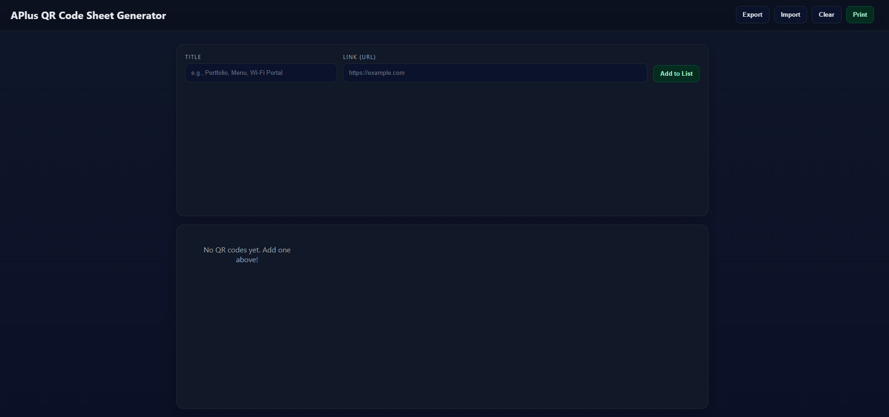

## APlus-QR-Generator

# Launched Site: https://crissal2.github.io/QR-Code-Generator/

  # License
  
  
## Description
  
  - Creates QR Codes, titles them, and makes them cleanly printable!
  
## Table of Contents
  
  - [Installation](#installation)
  - [Features](#features)
  - [Questions](#questions)

  
## Features
  
  - Enter Title of QR Code

  - Enter URL link and click "Add to List" to generate QR code
  
## Questions
  
  - https://github.com/crissal2
  
  - salgado.chris.m@gmail.com
  
